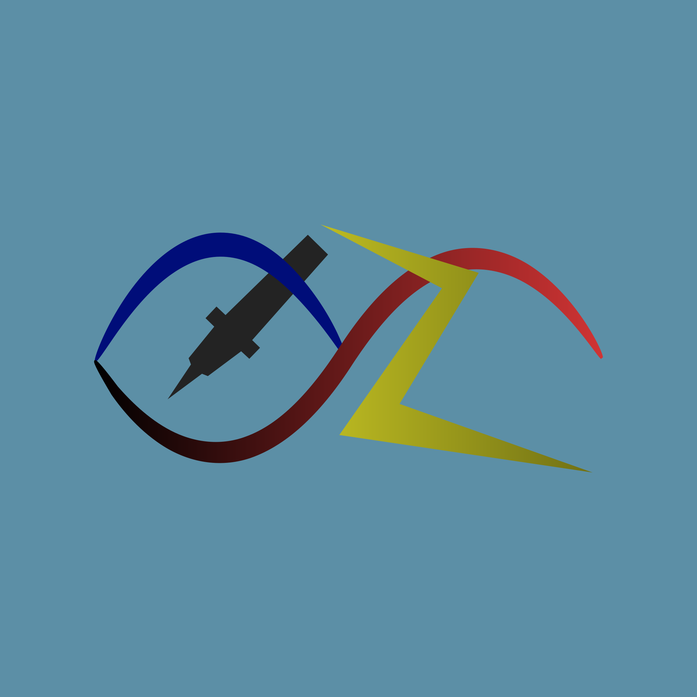

# Oz: Digital Logic Design App



Welcome to the Oz digital logic design app source code repository. Oz is a digital logic design application meant for
students and other people learning about digital design. It was created as the senior project for
the [Computer Engineering Department](https://sjsu.edu/cmpe/index.php) at [San Jose State University](https://sjsu.edu).

This repository contains all the source code for the desktop, mobile, and web versions of the app.

## Releases

There are built and signed releases for macOS, Windows, Linux, iOS, and Android available
on [GitHub](https://github.com/alexanderjshapiro/oz/releases).

### Platform/OS support

These are the operating systems and their versions that the app officially supports. It might work on many more
versions, but we don't test for those and can't guarantee the quality or security.

| Platform | Tested  | Supported           |
|----------|---------|---------------------|
| macOS    | Ventura | Mojave and newer    |
| Windows  | 10      | 7 and newer         |
| Ubuntu   | ×       | 18.04 LTS and newer |
| Debian   | ×       | 9 and newer         |
| Chrome   | 113     | 96 and newer        |
| Safari   | ×       | 14 and newer        |
| Edge     | 113     | 14 and newer        |
| Firefox  | 113     | 99 and newer        |
| iOS      | 16      | 11 and newer        |
| Android  | ×       | 19 and newer        |

## Features

- Add and remove components from the canvas
- Draw and remove wires between components
- Play, pause and, step circuit simulation
- Probe component ports and view port value over time
- Clear canvas

## Building the app

If Flutter is not already installed, see the
Flutter [installation instructions](https://docs.flutter.dev/get-started/install).

1. In the project folder, create the platform runners:
    ```shell
    flutter create .
    ```

2. Ensure that a device or emulator is connected and available. The device ID is the second field.
    ```shell
    flutter devices
    ```

3. Run the application. By default, the application is run on the first available device and in debug mode.
    ```shell
    flutter run [-d <device ID>] [--release]
    ```

## Releasing the app

```shell
flutter build <platform>
```

## Repository structure

- **lib/**
    - **component.dart** - Component widget
    - **editor_canvas.dart** - Main canvas area and frontend helper functions
    - **logic.dart** - Backend digital logic simulation calculations
    - **main.dart** - Entry file for the main process
    - **waveform.dart** - Waveform analyzer
- **.metadata** - Flutter properties
- **analysis_options.yaml** - Static code analysis settings
- **pubspec.lock** - Generated dependency requirements
- **pubspec.yaml** - Project properties and dependency definitions

## Vocabulary

Explanations for some common words used in the documentation and code in this repository.

- **App** - This entire product (everything in this repository) is the "Oz Digital Logic Design App", or App for
  short.
    - **Widget** - Reusable Flutter GUI element
        - **Component** - Class that contains properties and frontend representation of a single circuit component such
          as an IC
            - **Node** - Digital logic node that has a value such as one, zero, high-impedance, etc.
            - **PhysicalPort** - Represents a positioned pin on a component which is connected to a node
        - **EditorCanvas** - Class that keeps track of all components, wires, and probes, and uses their positions to
          display them on a grid, usually referred to as the canvas
        - **setState** - Redraws the widget after changing the model

## License

Version 1, 13 May 2023

Copyright © 2023 Andrew Emerson, Wayne Flores, and Alexander Shapiro.

This license agreement ("Agreement") is made and entered into by and between Andrew Emerson, Wayne Flores, and Alexander
Shapiro ("Licensor"), and the individual or entity accessing or using the software ("Licensee").

1. Grant of License. Licensor grants to Licensee a non-exclusive, non-transferable license to use the software specified
   in this Agreement ("Software") in accordance with the terms and conditions of this Agreement.

2. Permitted Use. Licensee may modify the Software for its own personal or internal business use, but may not distribute
   or sell any modified versions of the Software.

3. Ownership. The Software and all intellectual property rights in the Software are and shall remain the exclusive
   property of Licensor.

4. Attribution. Licensee must maintain any copyright or other proprietary notices that appear in or on the Software.

5. Term and Termination. This Agreement shall remain in effect until terminated by either party. Licensor may terminate
   this Agreement immediately if Licensee breaches any of the terms or conditions of this Agreement.

6. Disclaimer of Warranties. THE SOFTWARE IS PROVIDED "AS IS," WITHOUT WARRANTY OF ANY KIND, EXPRESS OR IMPLIED,
   INCLUDING BUT NOT LIMITED TO THE WARRANTIES OF MERCHANTABILITY, FITNESS FOR A PARTICULAR PURPOSE AND NONINFRINGEMENT.

7. Limitation of Liability. IN NO EVENT SHALL LICENSOR BE LIABLE FOR ANY DIRECT, INDIRECT, INCIDENTAL, SPECIAL OR
   CONSEQUENTIAL DAMAGES ARISING OUT OF OR IN CONNECTION WITH THE SOFTWARE OR THIS AGREEMENT, WHETHER OR NOT LICENSOR
   HAS BEEN ADVISED OF THE POSSIBILITY OF SUCH DAMAGES.

8. Governing Law. This Agreement shall be governed by and construed in accordance with the laws of California, United
   States of America, without giving effect to its conflict of laws provisions.

9. Entire Agreement. This Agreement constitutes the entire agreement between the parties with respect to the subject
   matter hereof, and supersedes all prior or contemporaneous agreements or understandings, whether oral or written.

10. Amendments. This Agreement may not be amended except in writing signed by both parties.

11. Acknowledgment. By accessing or using the Software, Licensee acknowledges that it has read this Agreement,
    understands it, and agrees to be bound by its terms and conditions.


